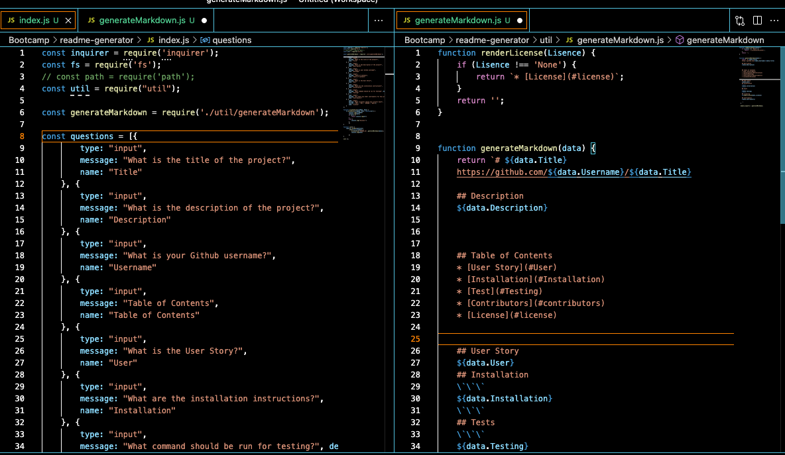
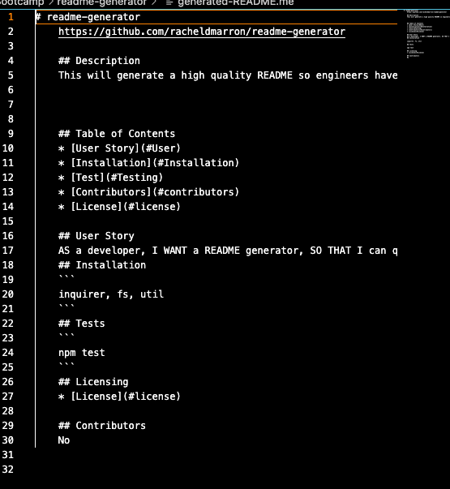

## README Generator

## Link to Deployed Assets
https://racheldmarron.github.io/readme-generator/
https://youtu.be/FgSEUMBeceA 

## Overview 
Using node index.js, the user will be able to enter pre-set questions on the command line that will generate a README file. 

## User Story
```md
AS A developer
I WANT a README generator
SO THAT I can quickly create a professional README for a new project
```

## Acceptance Criteria
```md
GIVEN a command-line application that accepts user input
WHEN I am prompted for information about my application repository
THEN a high-quality, professional README.md is generated with the title of my project and sections entitled Description, Table of Contents, Installation, Usage, License, Contributing, Tests, and Questions
WHEN I enter my project title
THEN this is displayed as the title of the README
WHEN I enter a description, installation instructions, usage information, contribution guidelines, and test instructions
THEN this information is added to the sections of the README entitled Description, Installation, Usage, Contributing, and Tests
WHEN I choose a license for my application from a list of options
THEN a badge for that license is added near the top of the README and a notice is added to the section of the README entitled License that explains which license the application is covered under
WHEN I enter my GitHub username
THEN this is added to the section of the README entitled Questions, with a link to my GitHub profile
WHEN I enter my email address
THEN this is added to the section of the README entitled Questions, with instructions on how to reach me with additional questions
WHEN I click on the links in the Table of Contents
THEN I am taken to the corresponding section of the README
```

## How This Was Achieved
<ul>
<li>Created and index.js file and pulled the inquirer through node using an npm init and npm install </li>
<li> Added a generatemarkdown file where the formatting of the README file lives</li>
<li>When a user uses node index.js on the command line, they are walked through generated questions they can answer to create their readme file</li>
<li>Using the writetofile and init functions, a readme generator is created once the user answers all the questions on the command line</li>
</ul>

## Visual Representations
## Images 




## Video


- - -
© 2021 Rachel Delaney Marron, Inc. All Rights Reserved.